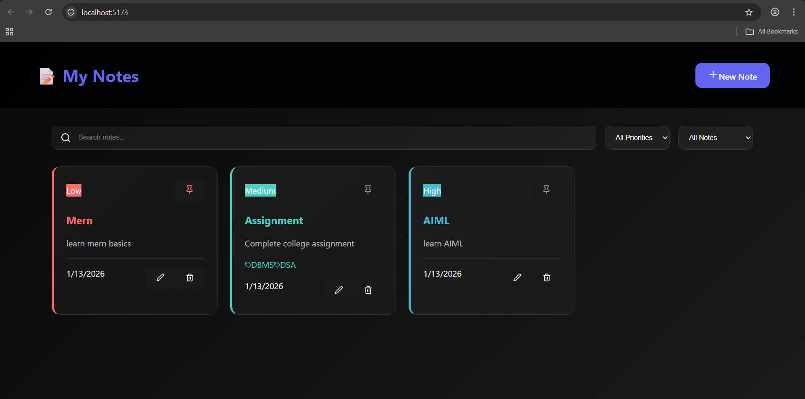

# 📝 My Notes App

A modern **Notes Management Application** built using **React** with a clean dark UI and backend API integration.  
This project focuses on **real-world frontend–backend communication**, CRUD operations, and scalable component-based design.

---

## ✨ Features

- ➕ Create new notes
- ✏️ Edit existing notes
- 🗑️ Delete notes
- 📌 Pin / unpin important notes
- 🔍 Search notes by title or content
- 🎯 Filter notes by priority (Low / Medium / High)
- 📅 Auto-sorted by pinned & latest notes
- ⚡ Real-time UI updates
- 🌙 Clean dark-themed modern UI

---

## 🖼️ Screenshot



>
---

## 🛠️ Tech Stack

### Frontend
- React (Vite)
- JavaScript (ES6+)
- Axios
- CSS (Component-based styling)
- Lucide Icons

### Backend
- Node.js
- Express.js
- MongoDB
- Mongoose
- REST API

---

## 📁 Project Structure
```
my-notes-app/
│
├── frontend/
│ ├── src/
│ │ ├── components/
│ │ │ ├── NoteCard.jsx
│ │ │ ├── NoteForm.jsx
│ │ │ ├── SearchBar.jsx
│ │ │ └── *.css
│ │ ├── api/
│ │ │ └── notesApi.jsx
│ │ ├── App.jsx
│ │ └── main.jsx
│ └── App.css
│
├── backend/
│ ├── models/
│ ├── routes/
│ ├── controllers/
│ ├── config/
│ └── server.js
│
└── README.md
```


---

## 🔌 API Endpoints

| Method | Endpoint | Description |
|------|---------|-------------|
| GET | `/api/notes` | Get all notes |
| POST | `/api/notes` | Create a new note |
| PUT | `/api/notes/:id` | Update a note |
| DELETE | `/api/notes/:id` | Delete a note |

---

## ⚙️ How It Works

1. User interacts with the React UI.
2. Axios sends HTTP requests to the Express backend.
3. Backend processes requests and performs CRUD operations using MongoDB.
4. API sends updated data back to the frontend.
5. UI updates instantly without page refresh.

---

## 🧠 Key Learnings

- Building scalable React components
- Managing global and local state
- Handling forms and modals correctly
- Connecting frontend with REST APIs
- Debugging real-world frontend–backend issues
- Designing clean UI for productivity apps

---

## ▶️ Getting Started

### Prerequisites
- Node.js installed
- MongoDB running locally or on MongoDB Atlas

---

### Backend Setup

```bash
cd backend
npm install
npm run dev
```

Create a .env file inside backend:
```
MONGO_URI=mongodb://localhost:27017/notesapp
PORT=5000
```
---

### Frontend Setup

```
cd frontend
npm install
npm run dev
```
Open in browser:
```
http://localhost:5173
```
---

## 🚀 Future Enhancements
- 🏷️ Tag-based filtering
- 🌈 Light/Dark theme toggle
- 🔐 User authentication
- ☁️ Cloud deployment
---

## 🏁 Conclusion
This project helped me bridge the gap between learning React concepts and building a real-world application with backend integration.
It strengthened my understanding of full-stack development and prepared me for larger MERN projects.
